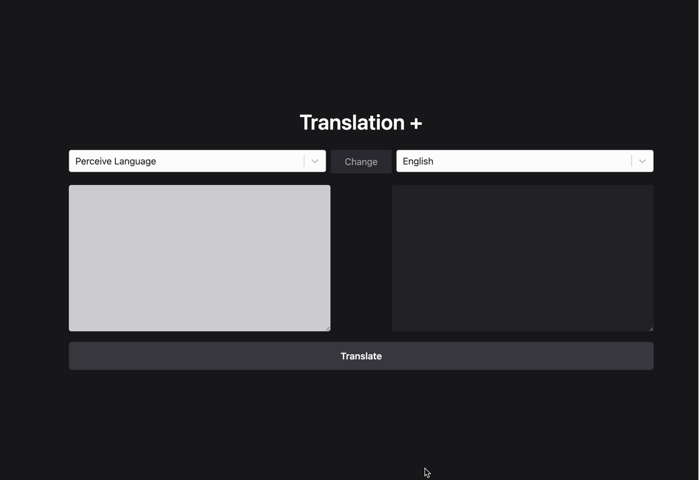

<h2>TRANSLATE</h2>

<h4>🚀 I took a great step in breaking language barriers! 🎉 I have published my open-source Translate project on GitHub! 💻✨</h4>

<h3>📌 What does it do?</h3>

<h4>This project enables fast and easy translation between different languages! 🌐💬</h4>

<h3>🛠️ Technologies Used:</h3>

<h4>⚡ Redux Toolkit 🗂️ for scalable global state management</h4>

<h4>⚡ Axios 🔄 for fast and reliable API requests</h4>

<h4>⚡ React Select 🎛️ for elegant and functional dropdowns</h4>

<h4>⚡ Tailwind CSS 🎨 for flexible and efficient styling</h4>

<h4>⚡ RapidAPI 🌍 for powerful translation services</h4>

<h3>services

💡 Who is it for?</h3>

<h4>Developers needing translations 👨‍💻👩‍💻</h4>

<h4>Those building multilingual applications 📱</h4>

<h4>Anyone looking for a user-friendly translation experience 🖥️</h4>

